# Microservices Architecture

## Overview
This application uses a microservices architecture for local LLM inference with Gemma2-2b-it and custom LoRA adapters running in the browser via MediaPipe.

## Architecture Diagram

```mermaid
graph TB
    %% User and External
    User[👤 User]
    CDN[☁️ CDN/File Storage<br/>LoRA Files]
    
    %% API Gateway
    Gateway[🚪 API Gateway<br/>Express.js]
    
    %% Core Services
    Frontend[🖥️ Frontend Service<br/>Next.js + MediaPipe]
    Backend[⚙️ Backend API Service<br/>Express.js]
    Auth[🔐 Auth Service<br/>Express.js]
    Database[🗄️ Database Service<br/>PostgreSQL/MongoDB]
    Cache[📦 Cache Service<br/>Redis]
    
    %% Supporting Services
    Analytics[📊 Analytics Service<br/>Express.js]
    Config[⚙️ Config Service<br/>Express.js]
    Catalog[📚 LoRA Catalog Service<br/>Express.js]
    
    %% User Interactions
    User --> Frontend
    
    %% Frontend Connections (through Gateway)
    Frontend --> Gateway
    Frontend --> CDN
    
    %% API Gateway Connections
    Gateway --> Backend
    Gateway --> Auth
    Gateway --> Catalog
    Gateway --> Config
    Gateway --> Analytics
    
    %% Backend Connections
    Backend --> Database
    Backend --> Cache
    Backend --> Auth
    Backend --> Analytics
    Backend --> Config
    
    %% Auth Service Connections
    Auth --> Database
    Auth --> Cache
    Auth --> Config
    
    %% LoRA Catalog Connections
    Catalog --> CDN
    Catalog --> Database
    Catalog --> Cache
    Catalog --> Config
    
    %% Analytics Connections
    Analytics --> Database
    Analytics --> Cache
    
    %% Config Service Connections
    Config --> Cache
    
    %% Styling
    classDef frontend fill:#e1f5fe,stroke:#01579b,stroke-width:2px
    classDef backend fill:#f3e5f5,stroke:#4a148c,stroke-width:2px
    classDef data fill:#e8f5e8,stroke:#1b5e20,stroke-width:2px
    classDef external fill:#fff3e0,stroke:#e65100,stroke-width:2px
    classDef support fill:#fce4ec,stroke:#880e4f,stroke-width:2px
    classDef gateway fill:#fff8e1,stroke:#ff6f00,stroke-width:3px
    
    class Frontend frontend
    class Backend,Auth backend
    class Database,Cache data
    class CDN,User external
    class Analytics,Config,Catalog support
    class Gateway gateway
```

## Services Overview

### Core Services

| Service | Technology | Purpose |
|---------|------------|---------|
| **Frontend** | Next.js + TypeScript + MediaPipe | User interface and local LLM inference |
| **API Gateway** | Express.js + http-proxy-middleware | Request routing, authentication, rate limiting |
| **Backend API** | Express.js + TypeScript | Core business logic and API endpoints |
| **Auth Service** | Express.js + Passport.js/JWT | User authentication and session management |
| **Database** | PostgreSQL + Prisma | Data persistence |
| **Cache** | Redis + ioredis | Session storage and performance optimization |

### Supporting Services

| Service | Technology | Purpose |
|---------|------------|---------|
| **LoRA Catalog** | Express.js + TypeScript | LoRA discovery and metadata management |
| **Analytics** | Express.js + InfluxDB | Usage tracking and performance metrics |
| **Config** | Express.js + node-config | Dynamic configuration management |
| **CDN/Storage** | AWS S3 + CloudFront | LoRA file storage and delivery |

## Key Design Decisions

### 🚪 API Gateway Pattern
- Single entry point for all API requests
- Centralized authentication and rate limiting
- Service discovery and load balancing
- Request/response transformation

### 🧠 Browser-Based Inference
- MediaPipe handles Gemma2-2b-it inference locally
- LoRA files downloaded directly from CDN
- No server-side GPU requirements
- Enhanced privacy and reduced latency

### 📦 Microservices Benefits
- Independent deployment and scaling
- Technology diversity (all Node.js for simplicity)
- Fault isolation
- Team autonomy

## Request Flow

1. **User Authentication**: Frontend → API Gateway → Auth Service
2. **LoRA Discovery**: Frontend → API Gateway → LoRA Catalog Service
3. **Model Inference**: Frontend → CDN (direct) → Local MediaPipe
4. **Analytics**: Frontend → API Gateway → Analytics Service
5. **Configuration**: All Services → Config Service

## Development Setup

Each service runs independently with its own:
- Package.json and dependencies
- Environment configuration
- Database/cache connections
- Docker container (for deployment)

## Deployment Strategy

- **Development**: Docker Compose with all services
- **Production**: Kubernetes with service mesh
- **Monitoring**: Centralized logging with Winston + ELK stack
- **CI/CD**: Individual service pipelines with shared infrastructure
